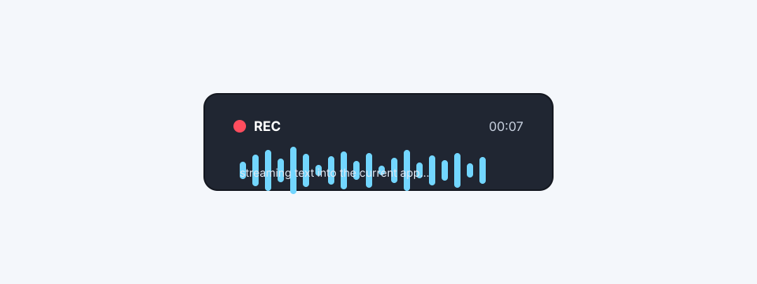

# QuickSType

QuickSType is a local-first push-to-talk dictation app for macOS and Windows. Hold the hotkey, speak, and text streams into the focused field while you talk.



## Privacy

- Transcription runs locally through Whisper.net and whisper.cpp.
- Audio is not uploaded for transcription.
- Crash reporting is optional, off by default, and only initializes when the user enables it and a Sentry DSN is configured by the build owner.
- Crash events are scrubbed for dictated text, email-like text, model paths, usernames, and audio-device names before they leave the process.

## Install

Public v1 installers are not published yet.

Planned v1 channels:

- Homebrew: `brew install --cask quickstype`
- Winget: `winget install QuickSType`
- GitHub Releases: signed macOS and Windows installers attached to the `v1.0.0` release

Canary update validation is still pending for signed `v0.99.0 -> v0.99.1` artifacts.

## Features

- Streaming dictation with live text updates while the hotkey is held.
- Tray-anchored recording HUD with elapsed time, REC indicator, waveform, and transcript preview.
- Type-and-replace injection path for streaming text, separate from clipboard paste fallback.
- Keyboard-layout-aware language hints.
- VAD and hallucination filtering for silence and short utterances.
- Model picker with hardware-aware recommendations.
- Velopack update flow on macOS and Windows.
- Optional crash telemetry with local PII scrubbing.

## Platforms

- macOS 13+ on Apple Silicon; Intel macOS is best effort.
- Windows 10/11 x64.
- Linux is best effort for development only. Release builds, installer support, tray behavior, global hotkey behavior, and text injection are not v1 targets.

## Languages

QuickSType uses Whisper model language support and exposes a curated language list in Settings. English, Hebrew, and Arabic are first-class v1 scenarios, with keyboard-layout hints used where the OS exposes layout metadata.

## Hardware

Recommended:

- Apple Silicon Mac, or
- Windows 10/11 x64 with 16 GB RAM, or
- Windows with CUDA-capable GPU.

Lower-resource machines can use smaller models and commit-on-pause mode.

## Build

Requires .NET 10 SDK.

```bash
dotnet restore
dotnet build
dotnet test QuickSType.sln
```

Run the UI:

```bash
dotnet run --project src/QuickSType.UI
```

Run the smoke harness:

```bash
dotnet run --project src/QuickSType.UI -- --smoke-test tests/fixtures/smoke.wav
```

## Package

Local Velopack packaging helpers:

```bash
# macOS arm64 canary package
bash build/package-local.sh 0.99.0 canary osx-arm64

# Windows x64 canary package
pwsh build/package-local.ps1 -Version 0.99.0 -Channel canary -Runtime win-x64
```

Release artifacts are produced by `.github/workflows/release.yml` from `v*` tags after Apple Developer ID, notarization, and Azure Artifact Signing credentials are configured.

## Project Layout

```text
src/
  QuickSType.Core/                cross-platform dictation, config, history, streaming
  QuickSType.Platform.Mac/        macOS permissions, hotkey/injection helpers, tray adapters
  QuickSType.Platform.Windows/    Windows permissions, hotkey/injection helpers, tray adapters
  QuickSType.UI/                  Avalonia app, settings, HUD, updates, telemetry
tests/
  QuickSType.Core.Tests/          core unit and contract tests
  QuickSType.UI.Tests/            UI view-model and service tests
  manual/                         release and manual verification matrices
build/
  package-local.sh                local Velopack packaging helper
  package-local.ps1               local Velopack packaging helper
```

## Known limitations

- Hebrew and English code-switching in one utterance can still require manual correction.
- Windows international layouts can collide with AltGr-style shortcuts; Right-Ctrl is the v1 default hotkey.
- macOS Accessibility permission is required for text injection. After updates, QuickSType self-checks the permission and shows a banner if it was lost.
- The HUD injection matrix still needs physical macOS and Windows verification before public v1 release readiness.
- Signed/notarized canary update testing is still pending for `v0.99.0 -> v0.99.1`.
- Local AOT packaging can fail on machines without the native OpenSSL linker setup; CI release builds are the authority.

## Contributing

See [CONTRIBUTING.md](CONTRIBUTING.md).

## Security

Please report vulnerabilities privately. See [SECURITY.md](SECURITY.md).

## License

MIT. See [LICENSE](LICENSE).
